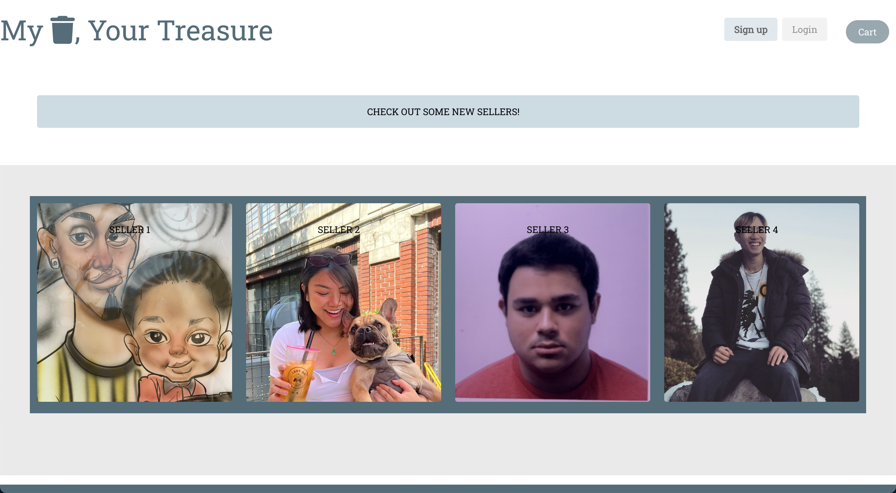
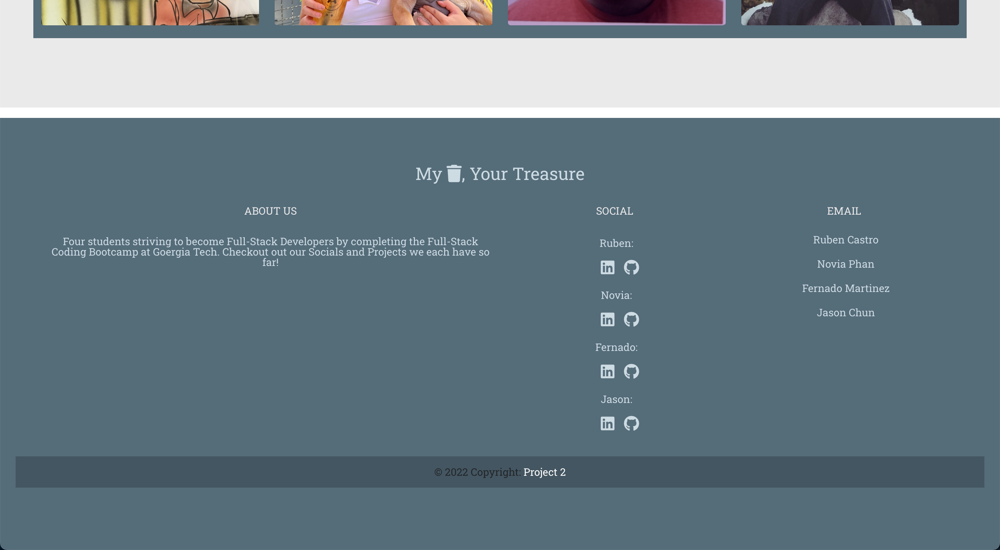

# Project 2: My Trash, Your Treasure

## Description

Too lazy to drive and take all your unneeded belongings to a flea market to sell? Or open your garage on a hot summer day to sell your worthless stuff? Check out this online garage sale application, My Trash, Your Treasure! 

Rather than the occasional putting up road signs that says "Garage Sale" and waiting for customers to drive by, you can now use social media to post what item(s) you have, how much in stock, pricing, and even a description explaining the history of the item(s). 

## Table of Contents

- [Installation](#installation)
- [Usage](#usage)
- [Credits](#credits)
- [License](#license)

## Installation

Since this isn't a deployed application, you'll need to fork or clone from the Github Repo. Here is the link:
- [Project 2 GitHub Repo](https://github.com/FMartinez59/My-Trash-Your-Treasure)

1. Clone from Repo

2. Open command-line in directory

3. `npm init`

4. `npm install bcrypt connect-session-sequelize dotenv express express-handlebars express-session handlebars mysql2 nodemon sequelize`

## Usage

1. Open command-line and enter:

    `mysql -u root -p`

    (Enter Password when prompted)

2. `source db/schema.sql` > `quit`

3. `npm run seed`

4. `npm start`

5. Open 'localhost:3001/' 

Then, you're welcomed by the homepage:

Down at the footer, you can find links to all of the group members' LinkedIn, Github, and Email:

Back at the top, you can either Sign up or Log in:

When you click one of the four sellers, you're directed to their profile page with their personal information, along with the items they are trying to sell:

*save/edit/delete to be continued

## Credits

GitHub:
- [Ruben Castro](https://github.com/RubenCastroCoding)
- [Novia Phan](https://github.com/supanov)
- [Fernado Martinez](https://github.com/FMartinez59)
- [Jason Chun](https://github.com/jasonchun7)

## License 

MIT License

Copyright (c) [year] [fullname]

Permission is hereby granted, free of charge, to any person obtaining a copy
of this software and associated documentation files (the "Software"), to deal
in the Software without restriction, including without limitation the rights
to use, copy, modify, merge, publish, distribute, sublicense, and/or sell
copies of the Software, and to permit persons to whom the Software is
furnished to do so, subject to the following conditions:

The above copyright notice and this permission notice shall be included in all
copies or substantial portions of the Software.

THE SOFTWARE IS PROVIDED "AS IS", WITHOUT WARRANTY OF ANY KIND, EXPRESS OR
IMPLIED, INCLUDING BUT NOT LIMITED TO THE WARRANTIES OF MERCHANTABILITY,
FITNESS FOR A PARTICULAR PURPOSE AND NONINFRINGEMENT. IN NO EVENT SHALL THE
AUTHORS OR COPYRIGHT HOLDERS BE LIABLE FOR ANY CLAIM, DAMAGES OR OTHER
LIABILITY, WHETHER IN AN ACTION OF CONTRACT, TORT OR OTHERWISE, ARISING FROM,
OUT OF OR IN CONNECTION WITH THE SOFTWARE OR THE USE OR OTHER DEALINGS IN THE
SOFTWARE.